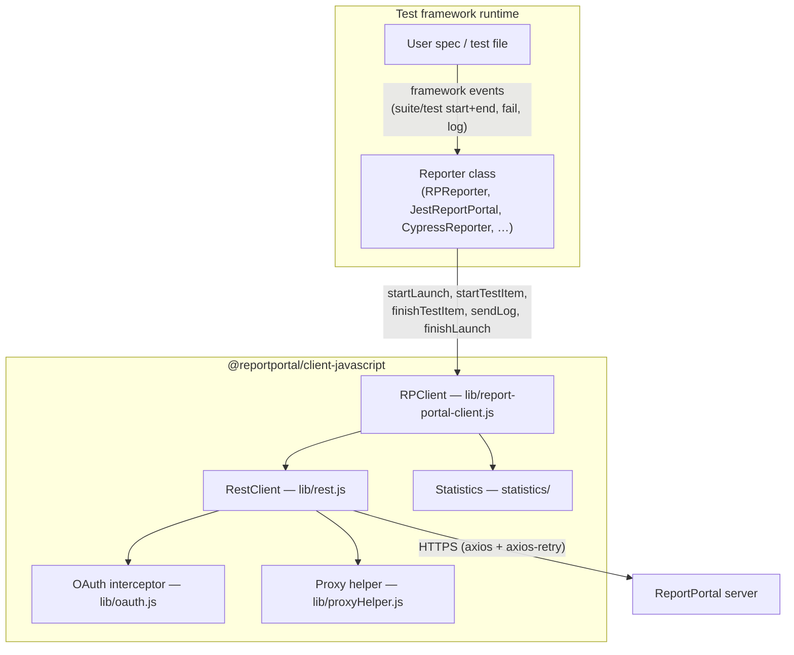
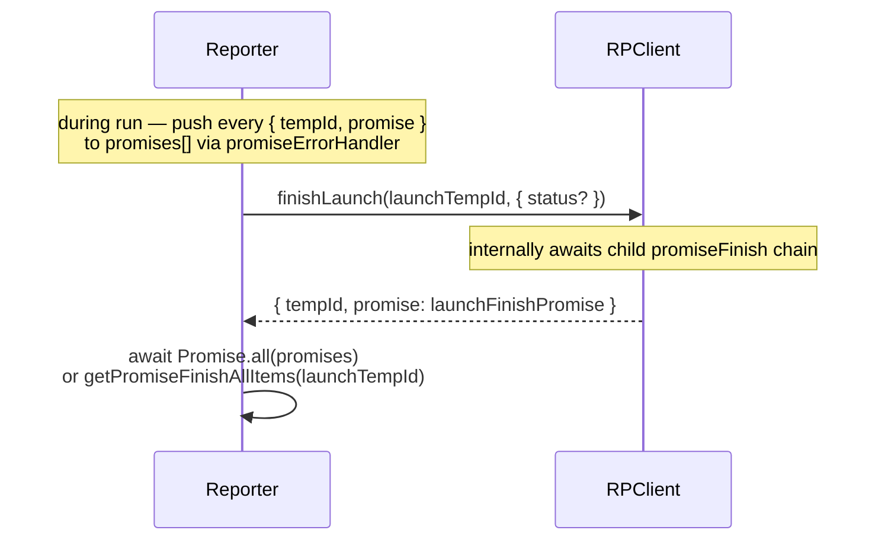
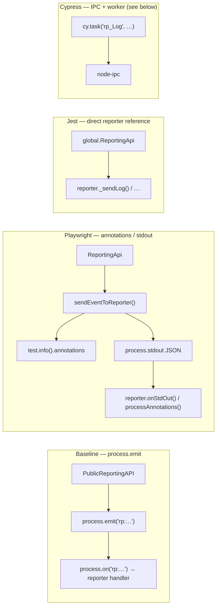
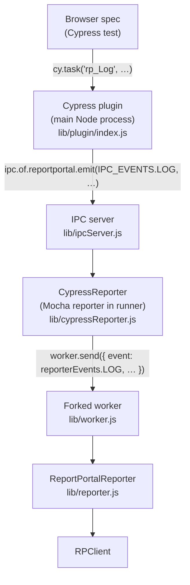

# ReportPortal Reporter Architecture

> **Purpose:** The shared mental model that applies to every JS reporter.
> Read this **once**; then `product-repos.md` only describes per-repo deltas
> from this baseline.
>
> **Use:** Before grep-hunting in a repo, check this file. 80% of "where does
> X happen" answers live here, not in a specific repo.

---

## The pattern (shared across all JS reporters)

The same three-layer stack appears in every agent — only the reporter's
event vocabulary and the bridge for in-test injection differ by framework.



**The reporter's only job** is translation — turn the framework's event
vocabulary (e.g. Mocha's `EVENT_SUITE_BEGIN`, Playwright's `onTestBegin`)
into RPClient calls. Everything else (HTTP, retries, auth, payload IDs,
statistics) is in `client-javascript`.

Reporter responsibilities in every agent:

- implements the framework's reporter/listener interface
- holds an `RPClient` instance
- holds state maps (suite tempId → RP suite item, test tempId → RP test item, …)
- maintains a promise queue (all RP calls are fire-and-forget during the run)
- bridges in-test attribute/log/status injection (mechanism varies — see below)

RestClient defaults (`lib/rest.js`): axios instance, 30 s timeout, 6 retries,
exponential backoff capped at 200–5000 ms (delay reduced by up to 40 % jitter),
optional OAuth interceptor (attached **before** retry), optional proxy via
`lib/proxyHelper.js`.

---

## The launch lifecycle (true for every reporter)

```
1.  startLaunch(launchObj)                     → returns { tempId, promise }
        │
2.  for each suite hit:
        startTestItem(suiteObj, launchTempId, parentTempId?)
                                               → suite tempId
        │
3.  for each test hit:
        startTestItem(testObj, launchTempId, suiteTempId)
                                               → test tempId
        │
4.  during test: sendLog(testTempId, { level, message, file? })
        │
5.  finishTestItem(testTempId, { status, attributes?, description? })
        │
6.  finishTestItem(suiteTempId, …)
        │
7.  finishLaunch(launchTempId, { status? })
        │
8.  (optional) mergeLaunches({ … })           when running in parallel
```

`tempId` is **not** the RP server's UUID — it's a local handle (a
`randomUUID()` in current client versions). The real UUID is assigned
asynchronously when the server responds. Every RP call returns
`{ tempId, promise }`; the reporter pushes the promise into a queue and
never awaits it inline (so a slow network never blocks the test run).

### Draining the promise queue at shutdown

There is no single universal drain helper — reporters combine these
strategies:

| Strategy | Where | What it does |
|----------|-------|--------------|
| Reporter-owned `promises[]` | Jest (`this.promises`), Playwright (`addRequestToPromisesQueue`) | Every RP call's promise is pushed; `Promise.all(promises)` runs in `onRunComplete` / `onEnd`. |
| `getPromiseFinishAllItems(launchTempId)` | Cypress (when attaching to an existing `launchId`), some merge flows | Returns `Promise.all` over direct launch children only. |
| Implicit drain inside `finishLaunch` | All reporters that call `finishLaunch` | `RPClient.finishLaunch` awaits all child `promiseFinish` values before sending the launch-finish HTTP request. |

Typical shutdown sequence:



This is why every reporter has a `promiseErrorHandler(promise, msg)`
wrapper — promises run in the background, so unhandled rejections need
to be caught and logged, not thrown.

---

## State the reporter MUST track

Every reporter, regardless of framework, keeps something like:

| State                         | Key                            | Value                                    | Why                                                                 |
|-------------------------------|--------------------------------|------------------------------------------|---------------------------------------------------------------------|
| Active launch                 | —                              | `launchTempId`                           | Parent for every suite                                              |
| Suite stack                   | suite identifier (path/name)   | `{ tempId, …extras }`                    | A test needs its parent suite's tempId                              |
| Test items in flight          | test identifier                | `{ tempId, startTime }`                  | finishTestItem needs the start tempId                               |
| Hooks                         | hook identifier                | `{ tempId, status }`                     | Hooks become RP items if `reportHooks: true`                        |
| Per-test finish overrides     | test identifier                | `{ attributes, description, status, … }` | In-test injection events arrive **before** finishTestItem fires     |

Look for class fields like `Map()` in the reporter's constructor — that's
the state. When suites/tests look duplicated or misordered in the UI,
this is the first place to check.

---

## How users inject data from inside a test

All paths end up mutating the reporter's per-test state so the data lands
on `finishTestItem`. The **transport** differs by framework.

### Baseline — `PublicReportingAPI` + `process.emit`

`client-javascript/lib/publicReportingAPI.js` exposes static methods
(`setDescription`, `addAttributes`, `addLog`, `setStatus`, `setTestCaseId`,
`setLaunchStatus`, `addLaunchLog`). Each one calls
`process.emit('rp:<eventName>', payload)`.

Several agents — notably **mocha** and **jasmine** — subscribe with
`process.on('rp:<eventName>', handler)` (often grouped in a
`registerRPListeners()` helper). Handlers mutate the reporter's state for
the *currently active* test.

**However, each test-framework integration may implement its own custom or
more framework-native event-sharing mechanism.** Do not assume every agent
uses `process.on`. Check the specific repo before grep-hunting for
`registerRPListeners`.

Event names (from `client-javascript/lib/constants/events.js`):

```
rp:setDescription
rp:setTestCaseId
rp:setStatus
rp:setLaunchStatus
rp:addAttributes
rp:addLog
rp:addLaunchLog
```

### Framework-specific bridges (examples in this workspace)



| Agent | Bridge mechanism | Notes |
|-------|------------------|-------|
| Mocha, Jasmine | `process.emit` → `process.on` | Classic in-process pattern; reporter and test share a Node process. |
| Playwright | Playwright **annotations** or **stdout JSON** parsed in `onStdOut` | Tests run in Playwright worker processes; `sendEventToReporter` in `agent-js-playwright` pushes events through framework-native channels. |
| Jest | `global.ReportingApi` holds a direct reference to the reporter instance | Does not use `process.on`; each agent method calls reporter methods directly. |
| Cypress | `cy.task` → plugin IPC → Mocha reporter → forked worker | Multi-process; see next section. |

Each agent re-exports a `ReportingApi` / `PublicReportingAPI` wrapper
(sometimes adding framework-specific helpers). The wrapper's transport is
what differs — the reporter-side handler (`onEventReport`, state mutation
on finish) is the common destination.

### Cypress — out-of-process bridge (full topology)

Cypress runs specs in a browser context isolated from the Node reporter.
`process.emit` cannot cross that boundary, so the agent uses `cy.task()`
plus `node-ipc` and a forked worker:



See `agent-js-cypress/lib/plugin/index.js`, `lib/ipcServer.js`,
`lib/cypressReporter.js`, and `lib/worker.js`.

Cypress is the most complex topology among JS agents. Other frameworks may
also span multiple processes (e.g. Playwright workers), but they typically
do not need an IPC server — they use framework-native channels instead.

---

## Configuration surface

Options are split between what `RPClient` validates and what each agent
layer adds on top.

### RPClient options (`getClientConfig` in `lib/commons/config.js`)

Passed to `new RPClient(options, agentParams)`. Validated here; validation
errors are logged (not thrown) so a bad config does not kill the test run.

| Option | Required | Notes |
|--------|:--------:|-------|
| `apiKey` | ✓* | API key. Required unless `oauth` is set. |
| `oauth` | | OAuth password-grant config (`tokenEndpoint`, `username`, `password`, `clientId`, …). |
| `endpoint` | ✓ | RP API root, e.g. `https://rp.host/api/v2`. |
| `project` | ✓ | RP project name. |
| `launch` | | Launch name. Defaults inside `startLaunch` if omitted. |
| `attributes` | | Array of `{ key, value }`. Used in launch start and `mergeLaunches`. |
| `description` | | Launch description. Also used as merge-launch default description. |
| `mode` | | `"DEFAULT"` or `"DEBUG"`. Affects merge-launch search URL. |
| `debug` | | Verbose logging. |
| `skippedIsNotIssue` | | Client-level flag: when `true`, `finishTestItem` with `SKIPPED` status adds `issue: { issueType: 'NOT_ISSUE' }`. See truth table below. |
| `restClientConfig` | | Custom axios config (timeout, proxy, retry override, …). |
| `headers` | | Extra HTTP headers. |
| `launchUuidPrint` | | Bool. Print/export launch UUID on start. |
| `launchUuidPrintOutput` | | `STDOUT` / `STDERR` / `FILE` / `ENVIRONMENT`. |
| `isLaunchMergeRequired` | | `true` if parallel runs save launch UUIDs to temp files for later `mergeLaunches`. |

`token` is the **deprecated** alias for `apiKey` — `getApiKey` warns and
falls back if `apiKey` is missing.

### Per-agent reporter options (NOT in `getClientConfig`)

Each agent's README documents these. They are handled in the reporter
constructor or payload builders before/during RP calls.

| Option | Typical agents | Notes |
|--------|----------------|-------|
| `skippedIssue` | Jest, Playwright, Cypress, … | User-facing name. Agent maps to `skippedIsNotIssue` when constructing `RPClient`. |
| `extendTestDescriptionWithLastError` | Jest, Playwright | Default `true`. Agent appends the latest error to the test description on finish. |
| `uploadVideo` / `uploadTrace` | Playwright | Control attachment upload on test end. |
| `reportHooks` | Mocha, Cypress | Whether `before`/`after` hooks become RP items. |
| `scenarioBasedStatistics` | Cucumber | Cucumber-specific statistics mode. |
| `parallel` / `autoMerge` | Cypress | Parallel launch merge behaviour. |

### `skippedIssue` ↔ `skippedIsNotIssue` mapping

The user-facing agent option and the client option use **inverted**
boolean semantics. Agents perform the translation in their reporter
constructor:

| User sets (`skippedIssue`) | Agent passes (`skippedIsNotIssue`) | Effect on skipped tests |
|----------------------------|-------------------------------------|-------------------------|
| `true` (default) | `false` | Skipped tests **are** marked "To Investigate" in RP. |
| `false` | `true` | Skipped tests are **not** marked "To Investigate" (`NOT_ISSUE`). |

Some agents also set `issue: { issueType: 'NOT_ISSUE' }` directly on the
`finishTestItem` payload when `skippedIssue === false`, in addition to
passing `skippedIsNotIssue: true` to `RPClient`.

---

## Statistics / telemetry

On every `startLaunch`, `RPClient` calls `triggerStatisticsEvent()`
(`lib/report-portal-client.js`), which:

1. Fetches server info (`GET {endpoint}/info`) to read the RP instance ID.
2. Sends a Google Analytics Measurement Protocol event via
   `statistics/statistics.js` → `https://www.google-analytics.com/mp/collect`.

Payload includes client name/version, agent name/version (from the
`agentParams` argument to `new RPClient(options, agentParams)`), framework
version (when provided), and a persistent `client_id` stored in
`~/.reportportal/rp.properties` (`statistics/client-id.js`).

Opt out by setting the environment variable
`REPORTPORTAL_CLIENT_JS_NO_ANALYTICS`. Errors during tracking are caught
and logged — they never propagate to the test run.

---

## Where things actually live

| Concern                              | File (in `client-javascript`)                            |
|--------------------------------------|----------------------------------------------------------|
| `RPClient` class, all RP API methods | `lib/report-portal-client.js`                            |
| HTTP, retries, timeouts              | `lib/rest.js`                                            |
| OAuth interceptor                    | `lib/oauth.js`                                           |
| Proxy support                        | `lib/proxyHelper.js`                                     |
| Config validation                    | `lib/commons/config.js`                                  |
| Error types                          | `lib/commons/errors.js`                                  |
| PublicReportingAPI (process events)  | `lib/publicReportingAPI.js`                              |
| Event name constants                 | `lib/constants/events.js`                                |
| Status constants (`PASSED`, `FAILED`, `SKIPPED`, `STOPPED`, `INTERRUPTED`, `CANCELLED`, `INFO`, `WARN`) | `lib/constants/statuses.js` |
| Output type constants                | `lib/constants/outputs.js`                               |
| Multipart log+file builder           | `report-portal-client.js`: `buildMultiPartStream`        |
| Statistics / telemetry               | `statistics/statistics.js`, `statistics/client-id.js`    |

| Concern                              | File (in any reporter)                                   |
|--------------------------------------|----------------------------------------------------------|
| Reporter class entry                 | `lib/<framework>Reporter.js` or `src/reporter.ts`        |
| Payload builders (RP request shapes) | `lib/utils/objectCreators.js` or `src/utils.ts`          |
| Framework-specific constants         | `lib/constants/` or `src/constants/`                     |
| Public reporting re-export           | `lib/publicReportingAPI.js` or `src/reportingApi.ts`     |
| Storage (when complex)               | `storage.js` / `storage.ts` (cucumber, webdriverio)      |

---

## Invariants (don't break these)

1. **Never `await` RP calls inline** in a test event handler — push to a
   promise queue (`addRequestToPromisesQueue` / `promiseErrorHandler`).
   Blocking on the network would slow every test.
2. **Never throw from a reporter event handler** — the test framework
   sees that as a test-infrastructure failure. Catch and log instead.
3. **Always pair `startTestItem` with `finishTestItem`**, in matching
   order, with the right parent tempId. Stuck-launch bugs are 90% of the
   time a missed `finishTestItem`.
4. **Status flows up** — a failed test's parent suite (and the launch)
   should report `FAILED`. Each reporter does this differently; the logic
   is usually in `finishSuite` / `onSuiteEnd` / `finishTest`.
5. **Skipped tests** — honor the user's `skippedIssue: false` by passing
   `skippedIsNotIssue: true` into `RPClient` (see mapping table above).
   The client then adds `NOT_ISSUE` on `finishTestItem` when status is
   `SKIPPED`.

---

## Cross-repo change implications

A change inside `client-javascript` may force follow-ups elsewhere:

| Change                                           | Likely follow-ups                                                   |
|--------------------------------------------------|---------------------------------------------------------------------|
| Add/remove RPClient method                       | Every reporter that calls the missing/new method                    |
| Change `getClientConfig` validation              | Every reporter's README config table                                |
| Add a new `EVENTS.*` constant                    | Reporters that should expose it via their PublicReportingAPI        |
| Change retry / timeout defaults                  | None (transparent), but document in client-javascript README        |
| Change `finishTestItem` payload shape            | All JS reporters                                                    |
| Add OAuth field                                  | client-javascript only — reporters pass `oauth` through verbatim    |

When in doubt, the architect agent should declare which dependent repos
need follow-up PRs in `plans/<id>/design.md`.
